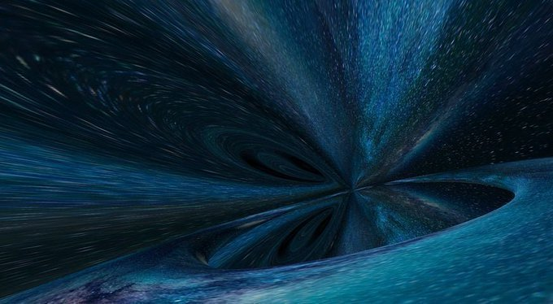
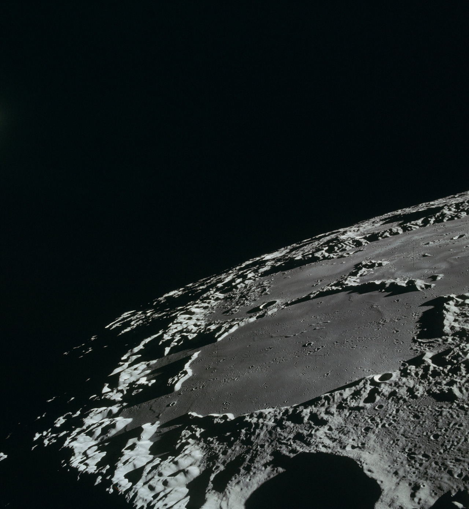

# Sidewalks

Side-quests o' my life...

## Hobbies

- Physics

  

  

- The Human Brain

- Musical Instruments
  - Guitar

- Space Exploration

  

  - [NASA SP-287](./Resources/Docs/NASA-SP-287.pdf)
    - How we landed on the moon? (Apollo Era)

    

The horizon awaits...

## Until Next Time .)
